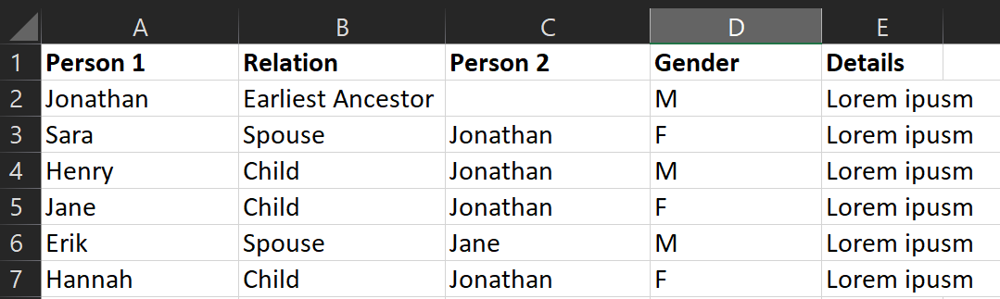

# AFRP-Family-Tree
This is a family tree python script that generates a .svg file of a family
tree from a csv file

# Data Setup
Create a input csv file that looks like:



The CSV file should read as: 

    "Person 1" is "Relation" of "Person 2"

Make sure the file is in the same directory as the python code, and the file name is the same as the file name in the code.

# Dependencies
Before running code you must install the following packages:

```
pip3 install pandas
pip3 install graphviz
sudo apt-get install graphviz
```

# Run the code
Run the code by using: 
```
python3 family-tree.py
```

The output svg file will be called: 
```
sample_ancestry.gv.svg.svg
```
